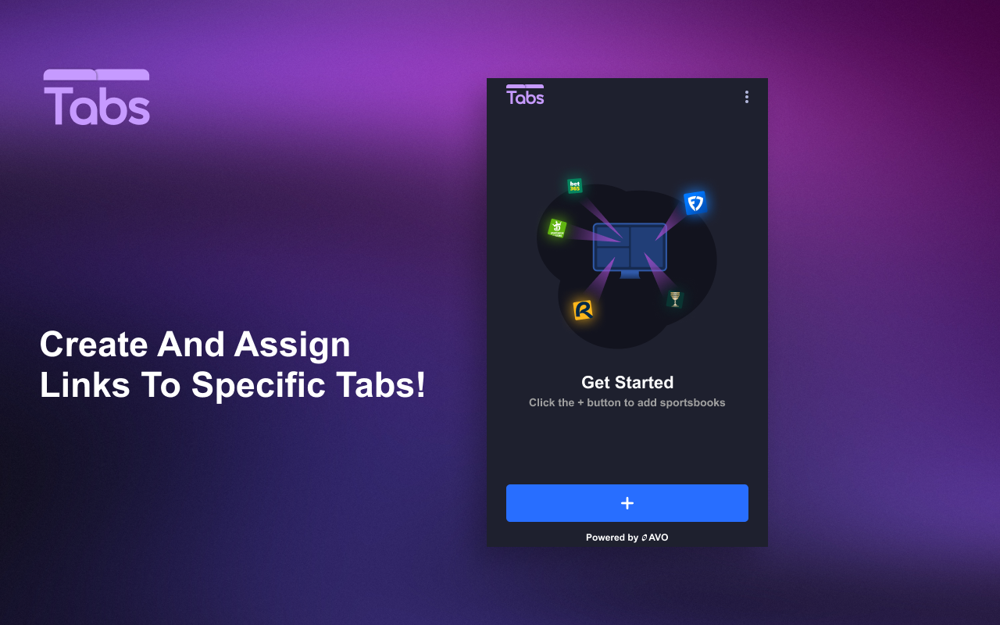
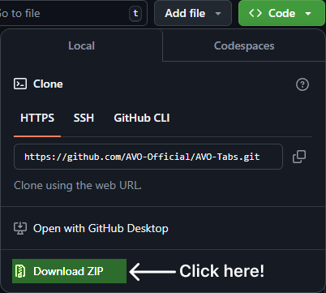
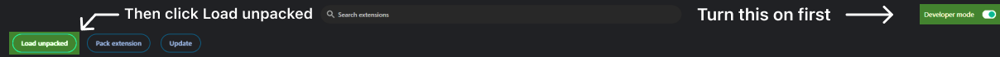

# AVO-Tabs

Assign links to open in specific tabs

## Features:
📝Create Custom Links
🖵Tab Generator
📁Tab Presets
🔎Search Functionality
🖱️Multi-link opening modes

Introducing AVO Tabs: the easiest way to open links in assigned tabs!

AVO Tabs allows you to quickly assign links to open in specific tabs, making it simple to stay organized. Create tab presets in a variety of layouts for an even faster setup!

## Installation Instructions

### Step 1 - Download the plugin

-Click the button in the top right that says "<> Code"
-Then click "Download Zip"

### Step 2 - Unzip the file

#### On Windows:
-Right-click the ZIP file.
-Select "Extract All…".
-Choose a location and click "Extract".

#### On Mac:
-Double-click the ZIP file.
-The contents will automatically unzip into a folder in the same location.

### Step 3 - Install the plugin on chrome

-Go to chrome://extensions
-Turn on developer mode (top right)
-Then, click "Load unpacked" (top left)
-Choose the unzipped file

### You're good to go!

#### We recommend pinning the extension to your toolbar in google chrome for easier access
